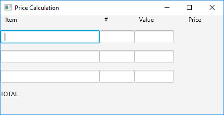
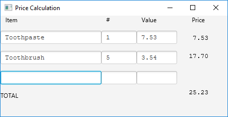

COMPX202-19B / COMPX242-19B Assignment 2
========================================

Due on **Friday, 26th July at 11:30pm**.


Experimenting with a big Java Package – JavaFX
==============================================

The goal of this exercise is to experiment with the JavaFX system for building user interfaces.
JavaFX is the recommended library for making user interfaces in desktop applications with
the current version of the Java language and development system.

JavaFX is described in the documentation supplied by Oracle,
found [here](http://docs.oracle.com/javase/8/javafx/api/toc.htm).
There is also a link in the notes for lecture 5.

This assignment has 3 parts:
 1. Taking a 'sample' program (different from the one examined in class) and experimenting to find out how it works.
 2. Extending or rewriting the sample program to layout a form in JavaFX.
 3. Adding callbacks to make your program interactive.

**You will update this document as part of your work.**


Preamble
========

1. Fork this repository using the button at the top of the project page.
2. Make sure that the visibility of your project is private. (Settings > expand Permissions > Project visibility: Private; Save changes).  *Note: Class teachers and tutors will still have read access to
your project for marking purposes.*
3. Clone the new repository to your computer using Git.  Develop and test the program on your computer 
as described below.
4. Remember to commit and push regularly as you work on the project!  Good Git usage, with regular commits having useful messages, will be required in the grading.
5. There are questions asked for each task and locations for answering each question in this document (after the task descriptions).  You should answer them in your copy of this document, which will be the README for your version of the project.


Task 1 (Note: instruction 1 updated on Saturday 20th July)
==========================================================

1. The project includes a sample JavaFX program - called A2.java.  Make sure that your clone of the repository includes A2.java.  Try compiling and running it. Compiling a
program in the lab requires compile and run commands in which you tell the system the names and locations of the JavaFX libraries.  This is the compile command:  
`javac --module-path /usr/share/openjfx/lib --add-modules=javafx.base,javafx.controls A2.java`  
and this is the run command:  
`java --module-path /usr/share/openjfx/lib --add-modules=javafx.base,javafx.controls A2`  
Find out what the program does when you enter text into the text boxes. Answer Question 1 (below).
2. In the same way as demonstrated in class, experiment with A2.java.  Make changes to the program.  Run it and see what effects your changes have. You should focus on features not seen in class.  To demonstrate your work, answer Question 2.  Your experiments should be different from those tried in class and should be distinct, not be minor variations on a theme.
3. Three new JavaFX classes used in A2.java are:  HBox, Text and TextField.  Question 3 asks you to describe them.

Task 1 Questions
----------------

```
Question 1
What does A2.java do when you enter text?

If you enter a word into the censor textbox ie. 'Andre' and you enter 'Yoink' into the replacement textbox, when I enter 'Andre' into the raw input it replaces
it with 'Yoink'. Any word in the raw input which matches a word in the censor box, is automatically replaced with the word in the replacement textbox.

Question 2
Describe three experiments you conducted on A2.java and in each case explain what you learned from the results.

Experiment 1: I commented out the line of code "VBox root = new VBox();" as I wanted to see what it did. When I ran the code it came up with multiple compiler errors and didn't run the application. I can see that I am getting an error
on all the objects based on this class. E.G. "A2.java:64: error: cannot find symbol root.getChildren().add(label4);" I have learntthat VBox has something to do with the layout of objects as none of the labels work anylonger. A quick
google confirmed this, saying "VBox lays out its children in a single vertical column..." - source: https://docs.oracle.com/javase/8/javafx/api/javafx/scene/layout/VBox.html

Experiment 2: I changed text1(2,3).setOnKeyReleased to text1(2/3).setOnMouseReleased. This changed the event listener to change the text when the mouse clicked off the current text box. Instead of automatically changing the same raw text with
the replacment text on key press the user now has to click on a non focused text box before anything happens. I have learnt that onKeyReleased feels a lot more fluid than onMouseReleaxsed listener and I have learnt more about how onKeyReleased works.

Experiment 3: I edited the code "Scene scene = new Scene(root, 400, 200);" to "Scene scene = new Scene(vbox11, 400, 200);". Changing root to vbox11. I did this because both root and vbox11 are VBox() classes. Therefore, I am curious to see
what would happen. Unsurprisingly the application did not compile, and more interestingly I got an error "VBox@36eda903is already inside a scene-graph and cannot be set as root". This means that I cannot use the vbox11 because it is inside
of the scene of the root VBox scene. I then commented out all the code relaed to vbox11 and this made the Censor textbox disappear. Not only this, but when I put for example "d" in the replacement textbox, and then an "a" in the raw input text
box, the resulting word in the raw input changes to "dad". So instead of replacing a word it does not know, it adds whatever is entered in the replacement textbox to the front and end of the raw input. I have learnt that, without the 
censor textbox the replacement textbox the class "applyCensorRules()" cannot perform "censoredText = rawText.replace(censored, replacement);" properly. Instead setting censored to a null value.

Question 3
For each of the classes HBox, Text and TextField briefly describe (a) the purpose of the class.

HBox: Is a class that organises its children (inheritance) in a form into horizontal columns . The h=horizontal, therefore in VBox the v=vertical. In this code, vbox11 and vbox12 are children of hbox1 which inturn is a child of root.
This is how the form is organised into vertical / horizontal labels and textfields. The vbox11 (Censored) and the vbox12 (Replacement text) are placed on the same level whereas the other labels are placed after the hbox1 on the next level.

Text: This class defines a node that can contain text, dates, numbers etc.

TextField: This class provides a small textbox/text field in a graphical manner for the user to enter text or for the application to output text into. 

```

Task 2
======

In this section you will extend the A2.java program to display a form that looks like this.



The idea is that the form allows a user to enter up to 3 items that might be purchased in a shop.  For each item the user can enter the name of the item, the number being purchased and the unit price(value).  In Task 3 it will be extended to continually update labels at the right to display total price for each item and at the bottom the total price for all items. Your task here is to decide on a layout using VBox and HBox.  A good solution will make use of font size and other parameters give a good appearance.  You can assume that none of the prices displayed are never greater than $999.


Task 2 Questions
----------------

```
There are no questions for this section.
```

Task 3
======

Using callbacks on key release for each text box: update your program to calculate item prices and final
totals.  (Update the display on every key entry to the program).  If values entered are not valid numbers,
don't display prices.


The screen shot shows the program with some data entered.




Task 3 Questions
----------------

```
Question 1.
What would happen if you used the key press event rather than the key release event.

On key press the call back function would immediatley be called, instead of having to wait for the key to be released first. This is a specificially
important feature in games, or other high paced environments where users are moving there characters quickly, they do not want to have to wait till the release
to move - would not feel as fluid. In the context of this assignment the key down or key release don't make too much difference. 

Question 2.
Is the use of key release satisfactory?  Are there situations in which edits are not detected? (hint: try using the mouse)

In most cases I believe it is satisfactory, especially if you are tabbing across the different text fields. However, if you right click on a 
text field with your mouse and edit it by "copy/paste/delete" etc, the application does not register a change. The mouse click is not considered
a key release and there would need to be a MousInputListener method as well the KeyInputListener to make sure the application could always respond.

```

Submission
==========

Your finished project should be in your GitLab repository.  If you have trouble with the repository you may make a zipped copy of your project files and submit that through Moodle.


Grading
=======

| Weighting | Allocated to |
|:----------:|------|
| 20% | Correct repository usage and settings |
| 20% | Task 1 questions and modifications |
| 30% | Task 2 code |
| 30% | Task 3 code and questions |